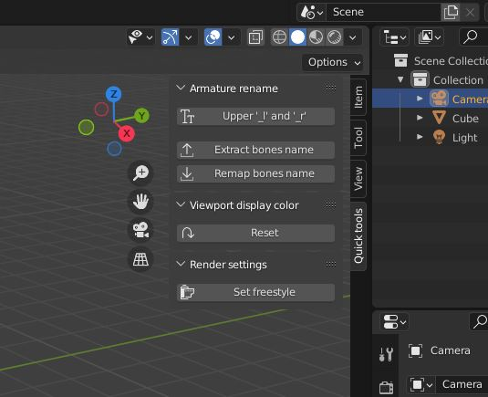

# BlenderQuickPanel

## Introduction
This panel includes features for renaming bones, reassigning color for visualization in the viewport and creating a specific setup for freestyle.
Used to rework an object imported into blender with its armature and materials. example: [Make human](http://www.makehumancommunity.org/) model

## Install
- copy the file /src/quick_tools.py locally
- in Blender, select the "Scripting" workspace
- from the text editor, open the quick_tools.py file
- run the script

## Usage
To access the panel, press the "n" key once in the 3D viewport and select the "Quick tools" tab

### Armature rename
#### Upper '_l' and '_r'
#### Extract and Remap bones name'

### Viewport display color

### Render settings